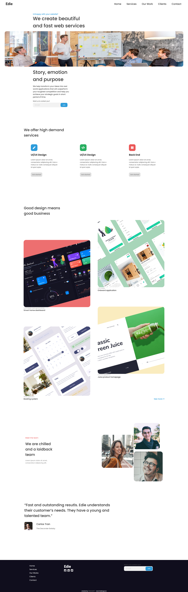
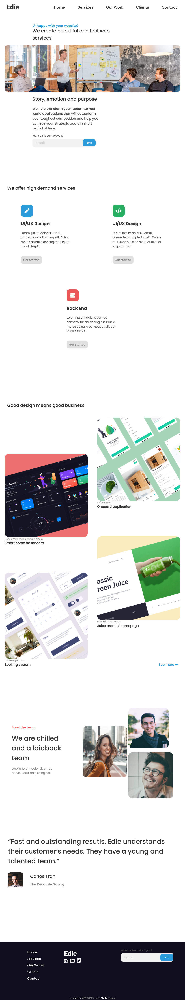

<h1 align="center">Edie's page Challenge</h1>

  <h3>
    <a href="https://hardcore-galileo-4c1ae9.netlify.app/">
      Demo
    </a>
     | 
    <a href="https://github.com/Atanas97/edie-s-page">
      Solution
    </a>
     | 
    <a href="https://devchallenges.io/challenges/xobQBuf8zWWmiYMIAZe0">
      Challenge
    </a>
  </h3>

## Screenshots

  Desktop version:  Tablet version: Phone version: 
  
  
  
  

### Built With

<!-- This section should list any major frameworks that you built your project using. Here are a few examples.-->

HTML and vanilla CSS (flexbox and grid)

